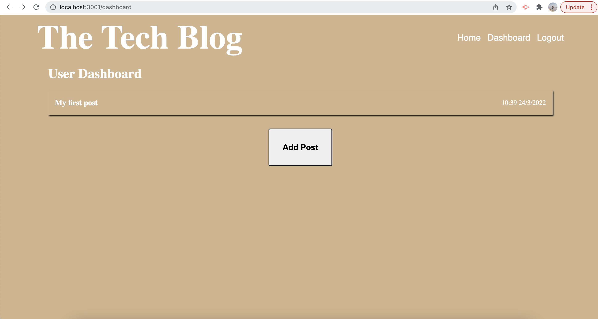

# blog-of-the-technicalVariety

## Description
This application was created to provide people with a tool to create and manage a blog. Others can add their thoughts to the on the blog. Users are asked to log in and out to use this application and if they haven't already signed up they will need to do so.

## Technologies Used
handlebars.js, js, css, nodejs.

## Installation
To install this project you will need to first clone the repository from github and then in the CLI you will need to run npm install so that all dependencies are installed. Next you will need to run the project on local host, the database can be created by using the mysql shell. Once this is done you will need to start the server by running npm start in the CLI. The working version of this application can be found by clicking on the following link. <a href="https://calm-castle-90070.herokuapp.com/login">my app</a>

## Usage

Once logged in people using this applicaiton can create a blog, update it as needed and also delete it. They can also comment on other people's posts and they can comment on your posts. 

I have used the handlebars template to show the front end of the application. 

When you first arrive on the home page, It will be blank so you need to either click the sign up or log in options located in the navbar in the top right hand corner of the page. 

If you're already a member you click login and fill in the form. 

If this is your first time on the application you will need to create an accout. on the sign up page.

To Create a post, go to the dashboard page and click the Add Post button. 

From there you will be taken to the add post page. where you can add a post title and body. once done press the Add Post button below. 

If it worked you should see the following page. 

To update or delete a post click on the post and you will be taken to a page that looks like this. 

On the home page you will see you blog where yourselfand others can comment on the post. Simply click on the post itself and a comment section will pop up below. 

Once you have written a comment press add comment button and your comment will show up below the blog post along with a time date and username of who has commented. 
Once you're finished doing all that you need to do, don't forget to log out. 

## License 
MIT

## Questions
If you have any questions regarding this application please don't hesitate to ask me <a href="https://github.com/skipsterling">My Github</a>
or Via email tomsterlingjames@outlook.com.au
